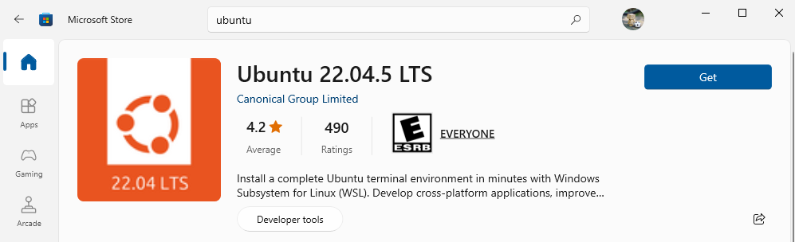

# Spark + CockroachDB project

## Setup WSL

- Open powercell admin run `wsl --install`
- Restart your computer
- Open powercell and run `wsl`
- Or you can download ubuntu from microsoft store to use it
  

* Simply install WSL via PowerShell and then install Ubuntu from the Microsoft Store. Once set up, you can start using Ubuntu in WSL.

## Setup environment Java

- Run `sudo apt update`

- Run `sudo apt install openjdk-11-jdk` for Window

## Clone repository github into WSL

- Open WSL terminal and run `cd /home/[username]`

- Access and clone `https://github.com/ngocxxu/spark-cockroachdb`

- Open source code by VS Code

- Press [Ctrl + `] to open terminal

## Setup Apache Spark

- Run `sudo apt install python3` (if you don't have python3)

- Run `sudo apt install pipenv` (if you don't have pipenv)

- Run virtual environment `pipenv shell`

- Run `pipenv install`

## Create ENV file

- Run `touch .env`

- Copy and paste into `.env` file

## Setup Certificate of CockroachDB in terminal

### Windows

```
mkdir -p $env:appdata\postgresql\; Invoke-WebRequest -Uri https://cockroachlabs.cloud/clusters/3a5b3a87-d1a5-4d07-8c27-a2525a220a6c/cert -OutFile $env:appdata\postgresql\root.crt
```

### Linux / WSL / Mac

```
curl --create-dirs -o $HOME/.postgresql/root.crt 'https://cockroachlabs.cloud/clusters/3a5b3a87-d1a5-4d07-8c27-a2525a220a6c/cert'
```

## Run Spark

- Run `pipenv run python3 ./scripts/create_user_data.py`

- Run `pipenv run python3 ./scripts/user_analysis.py`

## Run CockroachDB

# Optional with Jupiter Notebook - You can skip this step

## Setup docker

- Download docker desktop from [here](https://www.docker.com/products/docker-desktop/) and open it

- Run `docker-compose up -d` in your project if you want to open Jupiter Notebook at `http://localhost:8888`

`docker exec -it local_crdb cockroach sql --insecure -e "CREATE DATABASE IF NOT EXISTS spark_cockroach_db;"`

# CockroachDB on Host

## Setup

### Linux / WSL / Mac

- Run `wget https://binaries.cockroachdb.com/cockroach-v23.2.0.linux-amd64.tgz`

- Extract `tar -xvzf cockroach-v23.2.0.linux-amd64.tgz`

- Run `sudo cp cockroach-v23.2.0.linux-amd64/cockroach /usr/local/bin/`

- Run `sudo chmod +x /usr/local/bin/cockroach`

- Check version `cockroach version`

## Create Database in CockroachDB

```
docker exec -it cockroach1 ./cockroach sql --insecure --host=cockroach1:26257

CREATE DATABASE spark_cockroach_db;

SHOW DATABASES;
```

## Interative with CockroachDB Admin UI
