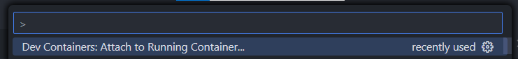
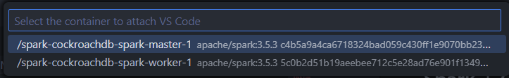
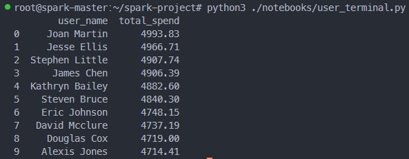
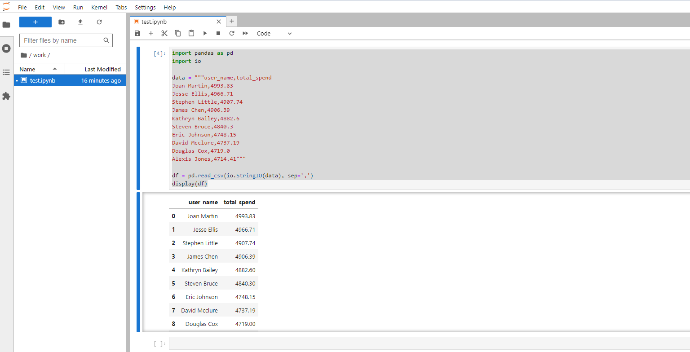

# Spark + CockroachDB project

## Setup WSL for windows

## Access to Spark Master

- Open Visual Studio Code and press `Ctrl + Shift + P`
- Type and click `Dev Containers: Attach to Running Container...`
  

- Choose `/spark-cockroachdb-spark-master-1`
  

## Open terminal in Spark Master - Remote VS Code

- After complete `Access to Spark Master` step, press [Ctrl + `] to open terminal

- Type `pip install pyspark` to install pyspark
  

- Run `spark-submit ./spark-project/scripts/user_analysis.py` in Terminal

- Run `pyspark` to start Spark Shell


## Additional in Spark Master - Remote VS Code

- Create a structure folder

```
spark-project/
├── data/
│   ├── raw/
│   └── processed/
├── notebooks/
├── scripts/
│   ├── product_analysis.py
│   └── utils.py
├── visualizations/

```

- Relationship

```
'user_id', 'user_name', 'email', 'total_spend', 'date', 'age', 'gender', 'location'
```

- `user_analysis.py`

```
from pyspark.sql import SparkSession
import pyspark.sql.functions as F
import matplotlib.pyplot as plt

# Create SparkSession
spark = SparkSession.builder.appName("UserAnalysis").getOrCreate()

# Read data of users
user_df = spark.read.csv("data/raw/user_data.csv", header=True, inferSchema=True)

# Analyze top users by total spend
top_spenders = user_df.groupBy("user_name").\
                       agg(F.sum("total_spend").alias("total_spend")).\
                       orderBy("total_spend", ascending=False).\
                       limit(10)
top_spenders.show()

# Analyze user spend trends over time
user_df = user_df.withColumn("date", F.to_date("date"))
spend_trend = user_df.groupBy("date", "user_name").\
                     agg(F.sum("total_spend").alias("total_spend")).\
                     orderBy("date")

spend_trend_pandas = spend_trend.toPandas()
plt.figure(figsize=(12, 6))
spend_trend_pandas.plot(x="date", y="total_spend", kind="line")
plt.title("User Spend Trend")
plt.xlabel("Date")
plt.ylabel("Total Spend")
plt.show()

# Save DataFrame top_spenders into file CSV
top_spenders_df = top_spenders.toPandas()
top_spenders_df.to_csv("visualizations/top_spenders.csv", index=False)

# Save spend trend chart to image file
plt.savefig("visualizations/spend_trend.png")
```

- `create_user_data.py`

```
import pandas as pd
from faker import Faker
from datetime import datetime, timedelta

fake = Faker()

# Create a DataFrame to store user data
user_data = pd.DataFrame(columns=['user_id', 'user_name', 'email', 'total_spend', 'date', 'age', 'gender', 'location'])

# Create 100 sample users
user_list = []
start_date = datetime(2022, 1, 1)
for i in range(100):
    user_list.append({
        'user_id': f'U{i:03}',
        'user_name': fake.unique.name(),
        'email': fake.email(),
        'total_spend': round(fake.pyfloat(min_value=50, max_value=5000, right_digits=2), 2),
        'date': start_date + timedelta(days=i),
        'age': fake.random_int(min=18, max=65),
        'gender': fake.random_element(['Male', 'Female', 'Other']),
        'location': f"{fake.city()}, {fake.country_code()}"
    })

user_data = pd.concat([user_data, pd.DataFrame(user_list)], ignore_index=True)

# Save file CSV
user_data.to_csv('data/raw/user_data.csv', index=False)
```

- Install `pip install matplotlib`

- Install `pip install faker pandas`

- Run `python3 scripts/create_product_data.py` to create 100 sample products

- Run `python3 scripts/product_analysis.py` to analyze top selling product, high margin product, sales trends over time

- `notebooks/user_terminal.py`

```
import pandas as pd

# Read top spenders data
top_spenders_df = pd.read_csv("visualizations/top_spenders.csv")

# Display top spenders data
print(top_spenders_df)
```

- `notebooks/user_jupiter.py`

```
import pandas as pd
import io

# Data get from visualizations/top_spenders.csv
data = """user_name,total_spend
Joan Martin,4993.83
Jesse Ellis,4966.71
Stephen Little,4907.74
James Chen,4906.39
Kathryn Bailey,4882.6
Steven Bruce,4840.3
Eric Johnson,4748.15
David Mcclure,4737.19
Douglas Cox,4719.0
Alexis Jones,4714.41"""

df = pd.read_csv(io.StringIO(data), sep=',')
display(df)
```

- Watch table data on terminal

  - run `python3 ./notebooks/user_terminal.py`

    

- Watch table data on jupiter notebook

  - Access to `localhost:8888` (after run docker) to open jupiter notebook
  - Paste code below to create table

    
